# Weaver

> **An Actor-Based Autonomous Curriculum Graph Construction System**

Weaver uses a novel **two-phase architecture** with specialized LLM agents to autonomously extract knowledge from textbook content and construct a comprehensive curriculum graph with validated learning relationships.

---

## 🎯 The Problem We Solve

### The Missing Target Problem

When building knowledge graphs with LLMs, a fundamental race condition exists:

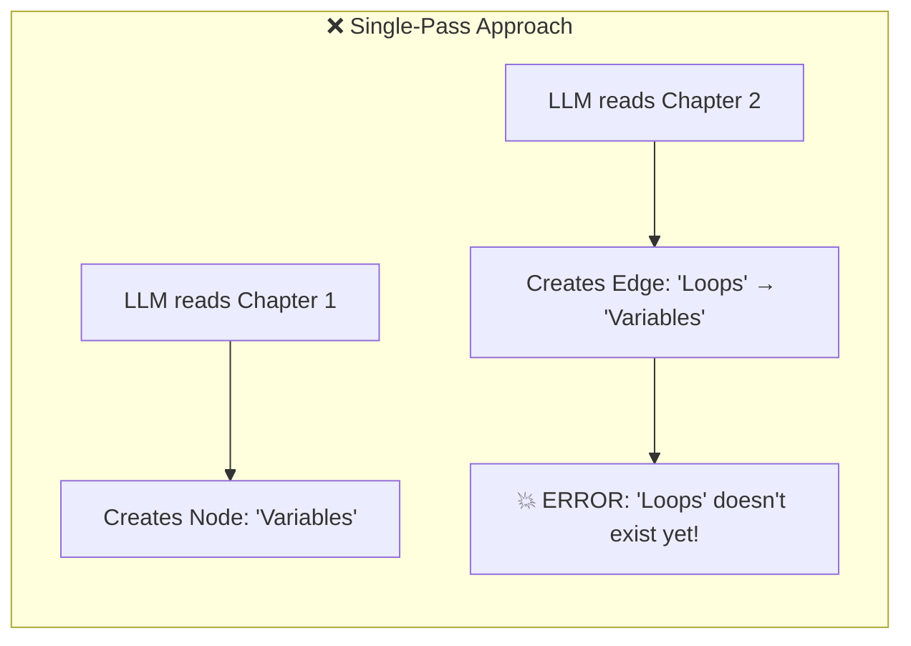

**The edge is created before its source node exists.** Traditional solutions involve complex retry logic and eventual consistency—fragile in practice.

### Our Solution: Two-Phase Architecture

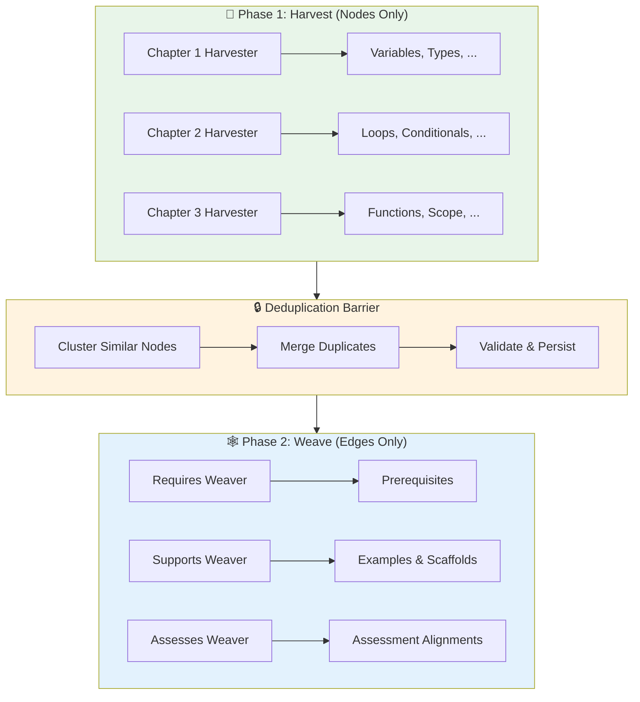

**All nodes exist before any edges are created.** The deduplication barrier ensures a clean, deduplicated graph state.

---

## 🏗️ System Architecture

### Actor Model Overview

Weaver is built on **kameo**, a Rust actor framework. Every major component is an isolated actor with message-based communication:

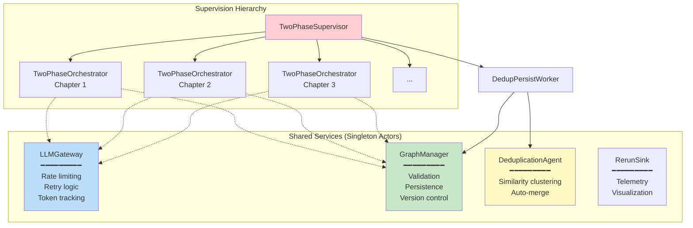

### Why Actors?

| Benefit | How We Use It |
|---------|---------------|
| **Isolation** | Each chapter has independent conversation state |
| **Concurrency** | Process N chapters in parallel safely |
| **Fault Tolerance** | Failed chapters don't crash the system |
| **Backpressure** | LLMGateway semaphore prevents API overload |
| **Cancellation** | Graceful shutdown with CancellationTokens |

---

## 🤖 LLM Gateway Architecture

The `LLMGateway` is the central coordinator for all LLM interactions:

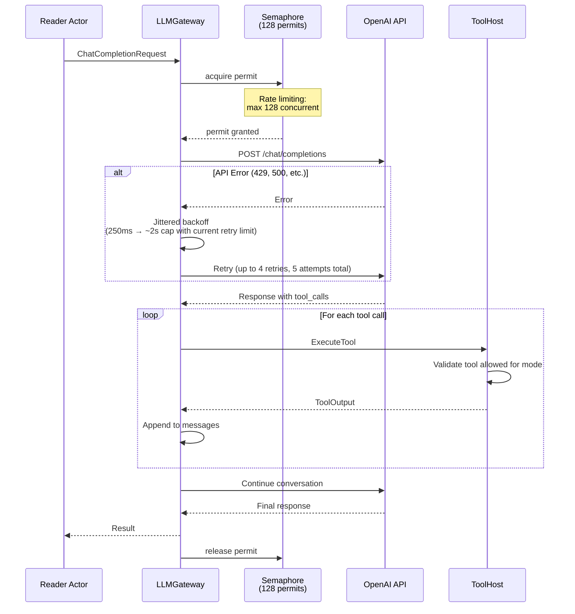

### Key Gateway Features

```rust
// Configurable constants (src/constants.rs)
LLM_MAX_CONCURRENT_REQUESTS: 128  // Semaphore permits
LLM_MAX_RETRIES: 5                // Per-request retry limit
REQUEST_TIMEOUT_SECS: 300         // 5-minute timeout
MAX_TOOL_ITERATIONS: 60           // Max tool loops per conversation
```

---

## 🔧 Tool System & Mode Enforcement

### The ToolHost Pattern

Each Reader actor wraps itself as a `ToolHost` that enforces mode-specific tool access:

```mermaid
flowchart TB
    subgraph "Reader&lt;HarvesterSpec&gt;"
        TH1[ToolHost::Harvester]
        TH1 --> Tools1["✅ graph_insert_knowledge<br/>✅ graph_update_knowledge<br/>✅ graph_insert_teaching_step<br/>✅ delegate_tasks<br/>✅ read_file_range<br/>✅ search_text<br/>❌ graph_add_requires<br/>❌ graph_add_supports"]
    end
    
    subgraph "Reader&lt;WeaverSpec&gt;"
        TH2[ToolHost::Weaver]
        TH2 --> Tools2["❌ graph_insert_knowledge<br/>❌ graph_update_knowledge<br/>✅ graph_add_requires<br/>✅ graph_add_supports<br/>✅ graph_add_assesses<br/>✅ graph_dag_check<br/>✅ graph_gap_summary<br/>✅ delegate_tasks"]
    end
    
    subgraph "LLM Gateway"
        GW[run_conversation<br/>exposes mode-scoped tool_ids]
        GW --> TH1
        GW --> TH2
        note over GW: Disallowed tools are not advertised; there is no per-call runtime deny list.
    end

    style Tools1 fill:#e8f5e9
    style Tools2 fill:#e3f2fd
```

### Compile-Time + Tool Surface

```rust
// Type-level mode specification (src/file_reader.rs)
pub trait ModeSpec: Send + Sync + 'static {
    const MODE: AgentMode;
    fn wrap_tool_host(actor: ActorRef<Reader<Self>>) -> ToolHost;
}

pub struct HarvesterSpec;  // Can only create nodes
pub struct WeaverSpec;     // Can only create edges

// Runtime enforcement
fn tool_identifiers_for_mode(mode: AgentMode) -> Vec<&'static str> {
    match mode {
        AgentMode::Harvester => vec![
            "graph_insert_knowledge",
            "graph_insert_teaching_step",
            // ... NO edge tools
        ],
        AgentMode::Weaver => vec![
            "graph_add_requires",
            "graph_add_supports",
            // ... NO node tools
        ],
    }
}
```

Gateway enforcement is by construction: only the mode's `tool_ids` are published to the LLM; there
is no per-call runtime deny list inside `LLMGateway::handle_tool_calls`.

---

## 🌾 Niche-Based Parallel Processing

Each phase uses **specialized niches** that run concurrently:

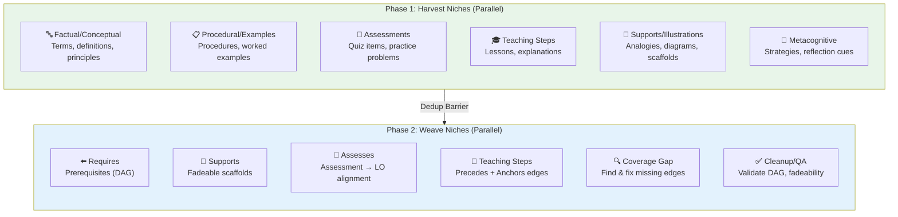

### Tagging System for Coordination

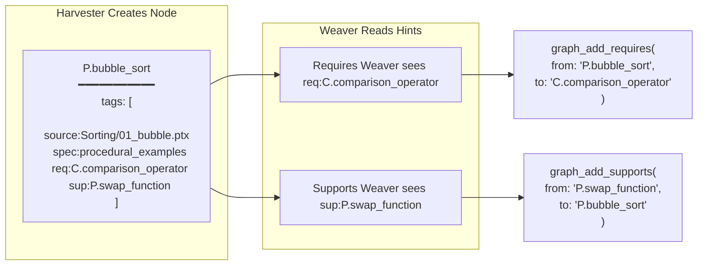

---

## 🔄 Supervisor Lifecycle

### ChildHandle Pattern

The `TwoPhaseSupervisor` manages chapters via `ChildHandle` structs created by a `ChildLauncher`:

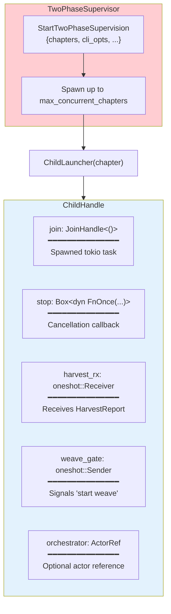

### Phase Coordination via Oneshot Channels

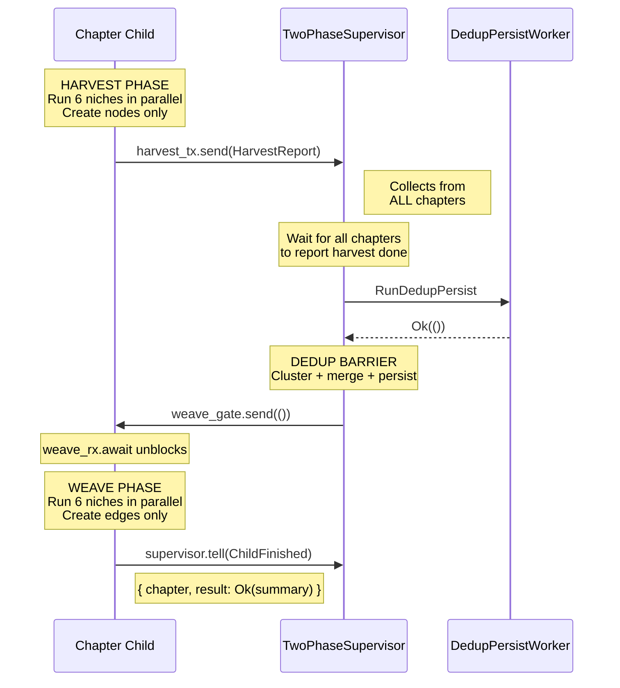

### Cancellation Flow

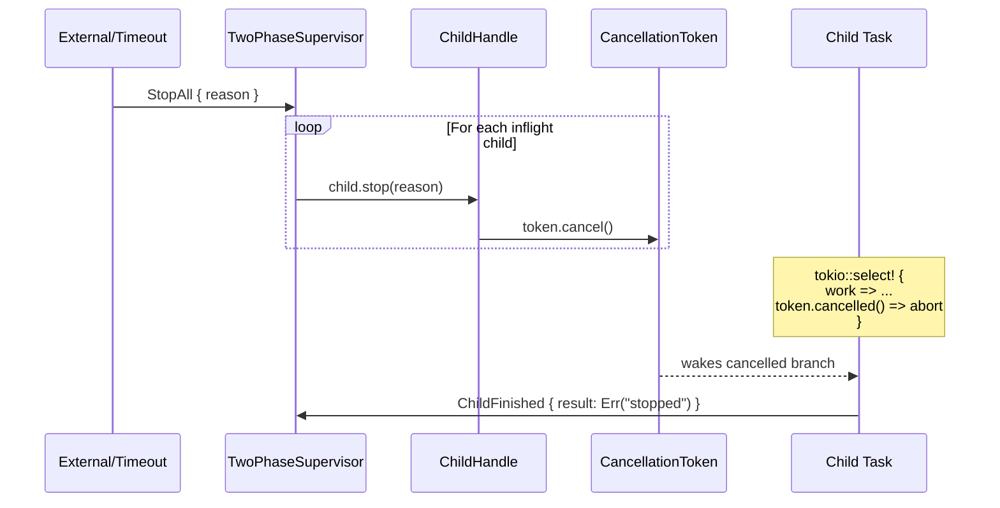

---

## ⏱️ Timeout & Cancellation Architecture

### Graceful Degradation

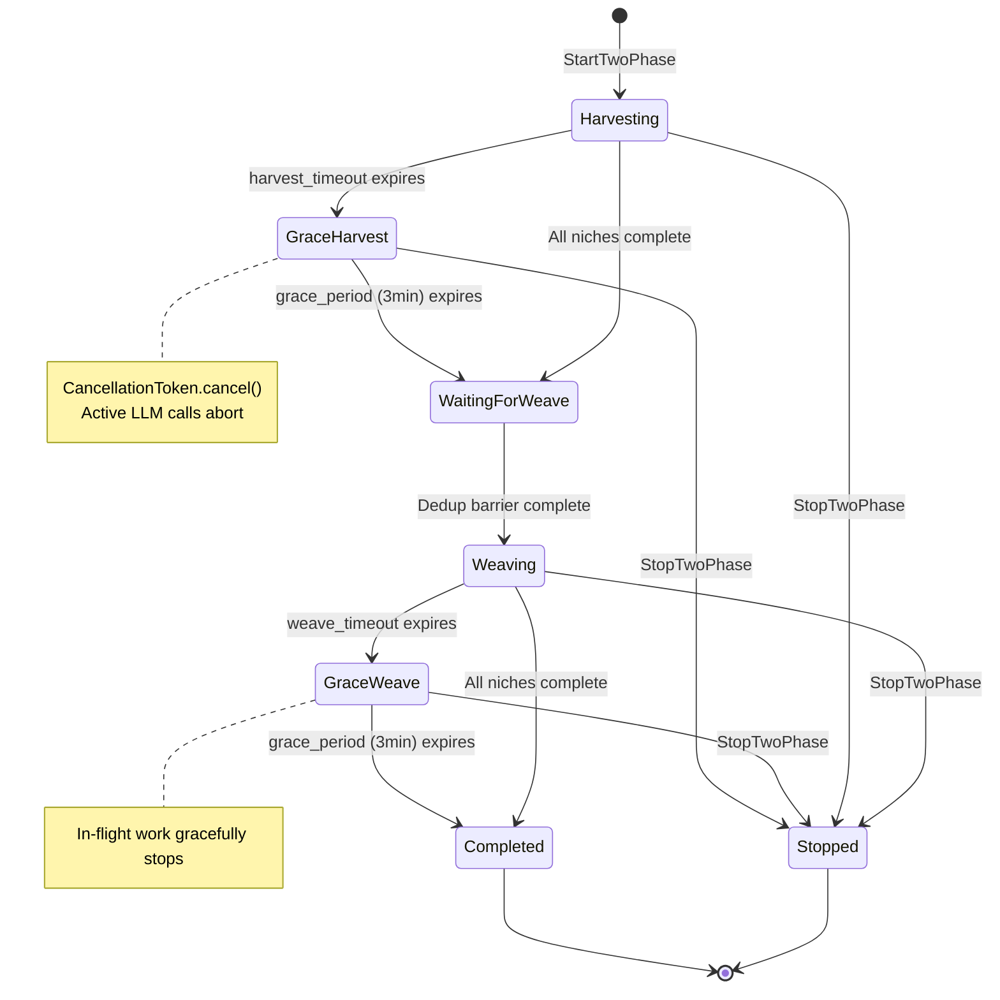

### Cancellation Token Propagation

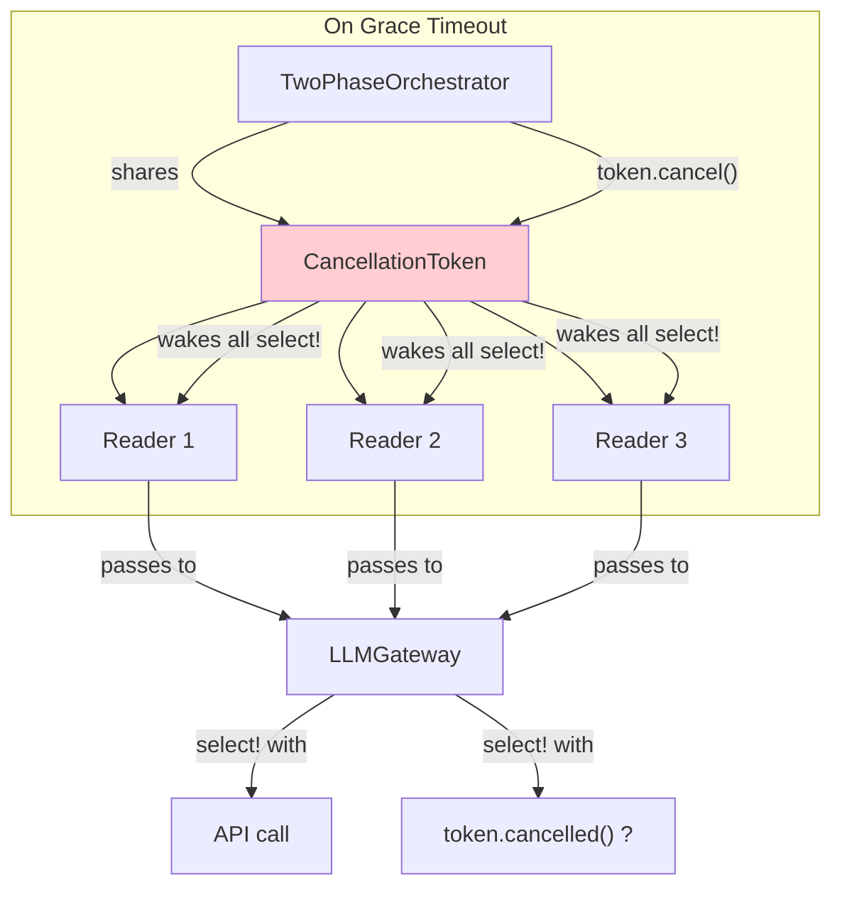

---

## 📊 Graph Data Model

### Node Types

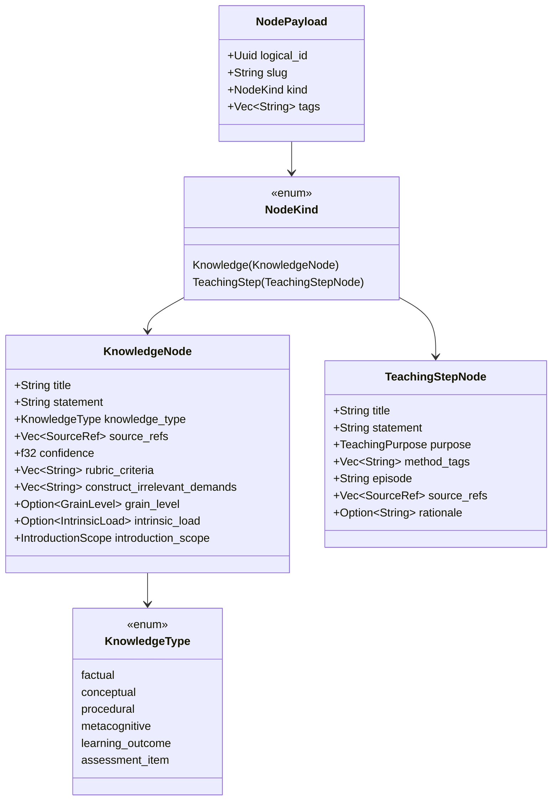

### Edge Types

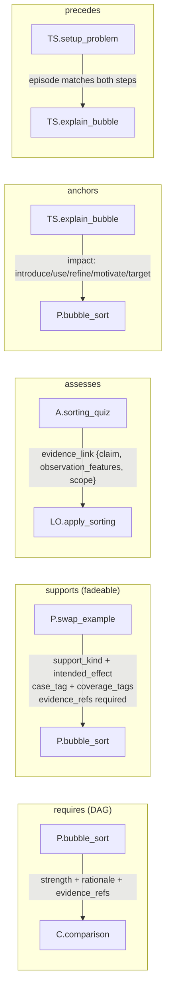

---

## 🚀 Running the System

### Two-Phase Mode (Autonomous)

```bash
# Set environment
export OPENAI_MODEL="your-model-name"
export OPENAI_API_BASE="http://your-endpoint:1234/v1"

# Demo run (matches run.sh: 13-way parallel, ~20/31 min timeouts)
./run.sh

# Manual run with defaults (4-way parallel, 1h/phase)
cargo run --release -- uncc_cs2-pretext-project \
  --max-concurrent-chapters 4 \
  --harvest-timeout-hours 1.0 \
  --weave-timeout-hours 1.0
```

### Monitoring

```bash
# Watch logs in real-time
tail -f logs/weaver.log | rg "WARN|ERROR|harvesting|weaving"

# Check for stuck processes
tail -f logs/weaver.log | rg "grace|cancel|timeout"
```

### Analyst Mode (Post-Processing)

After harvesting and weaving, use **Analyst Mode** for interactive analysis (read-only by default):

```bash
cargo run --release -- uncc_cs2-pretext-project --interactive
# alias: cargo run --release -- uncc_cs2-pretext-project --analyst
# opt-in to writable tools: cargo run --release -- uncc_cs2-pretext-project --interactive --interactive-writable
```

The Analyst has **read-only access** to powerful analysis tools:

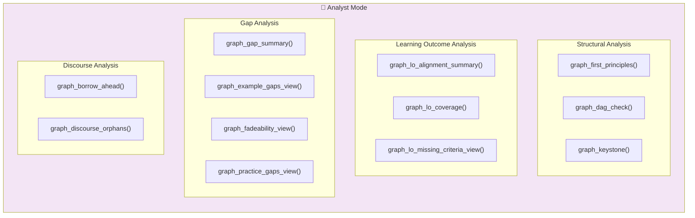

**Example Analysis Questions:**

| Question | Tool to Use |
|----------|-------------|
| "What concepts are foundational?" | `graph_first_principles_summary()` |
| "Are there any cycles?" | `graph_dag_check()` |
| "Which LOs lack assessments?" | `graph_lo_missing_criteria_view()` |
| "What examples are missing?" | `graph_example_gaps_view()` |
| "What are the keystone concepts?" | `graph_keystone()` |
| "Are concepts used before taught?" | `graph_borrow_ahead()` |

---

## 🔬 Novel Contributions

### 1. Two-Phase Graph Construction
Separating node creation from edge creation eliminates the "missing target" problem that plagues single-pass approaches.

### 2. Mode-Specific Tool Enforcement
Compile-time generics + runtime filtering provide **defense in depth** against LLM "hallucinating" tool calls.

### 3. Niche-Based Parallelism
Specialized agents (factual, procedural, assessments, etc.) enable efficient parallel extraction without conflicts.

### 4. Actor-Based LLM Orchestration
Using the actor model for LLM coordination provides:
- Natural rate limiting via semaphores
- Conversation isolation
- Graceful cancellation
- Fault tolerance

### 5. Deduplication Barrier
A synchronization point that ensures graph consistency before edge creation, preventing duplicate edges and missed connections.

### 6. Read-Only Analyst Mode
Launch with `--interactive` (or `--analyst`) to open the TUI in read-only mode; add
`--interactive-writable` only when you explicitly want the legacy writable FileReader tools.
A dedicated analysis agent with **26 inspection tools** for validating curriculum structure:
- Structural analysis (DAG check, keystones, first principles)
- Learning outcome alignment (coverage, reachability, criteria gaps)
- Quality gaps (examples, fadeability, practice assessments)
- Discourse coherence (borrow-ahead, orphaned steps)

---

## 📁 Key Source Files

| File | Purpose |
|------|---------|
| `src/main.rs` | Entry point, CLI parsing |
| `src/app.rs` | Actor bootstrap, runtime options |
| `src/app/two_phase/orchestrator.rs` | Per-chapter state machine |
| `src/app/two_phase/supervisor.rs` | Multi-chapter coordination |
| `src/file_reader.rs` | Reader actor, mode specs, tool filtering |
| `src/llm_gateway.rs` | LLM coordination, retries, rate limiting |
| `src/graph/service.rs` | Graph mutations, validation |
| `src/graph/manager.rs` | Graph actor, persistence |
| `src/tools/llm/graph_tools/` | Tool implementations |

---

## 📚 Further Reading

- [`AGENTS.md`](./AGENTS.md) - Detailed agent documentation
- [`docs/white_paper.md`](./docs/white_paper.md) - Domain model specification
- [`docs/graph_tools.md`](./docs/graph_tools.md) - Tool reference

---

*Built with Rust 🦀 + kameo actors + OpenAI-compatible LLMs*
